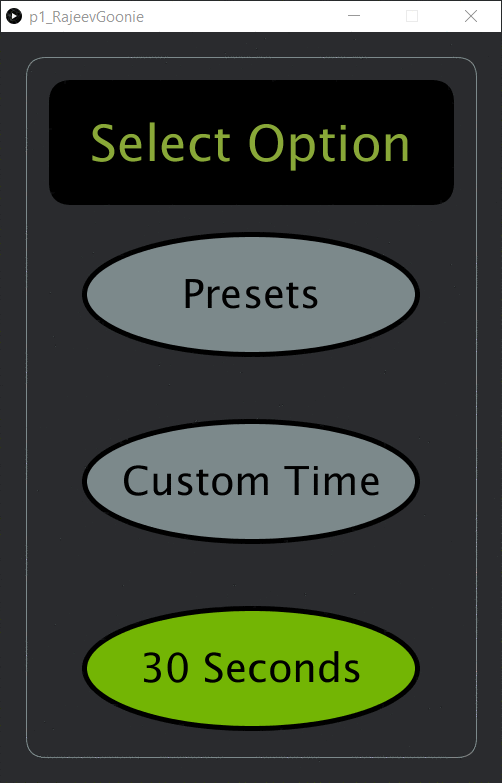

# HCI Project 1: The Microwave Interface

**Project Report Site:** https://rgoonie.github.io/p1.RajeevGoonie/

---
## Project Synopsis

### Purpose

This project was designed to make us think about everyday objects and their designs. Microwaves are an item that most people use very often is the focus for this project. While there are many designs for a microwave interface, not all designed the best for the user.

### Objective
My objective is to design a microwave interface that is user friendly and very simple to operate. I attempted to create a microwave interface that is very minimalistic and simplistic to operate. 

### Goals and Thoughts
Based of my microwave I have in the college dorm, my main goal was to remove the clustering of many buttons and categorize buttons in order to reduce the time it takes a user to find the button they need (More info found on the Project Report Site).

### Low Fidelity Sketch

### Final Design Screenshots

### Design Choices
**Why did I only include Presets, Custom Time, and 30 Seconds as options for the main screen?**

I felt like these options were the best way to catigorize all the options on a microwave. You either choose a preset, input a custom time, or need a quick 30 seconds to heat something up.

**Why do I only have popcorn, drinks, and by weight as food presets?**

Other than not being able to think of any other universal presets for heating up food/drinks, I felt like these were the most common presets people use as presets. By Weight I would imagine would be the most popular of these as the more food you have on a plate, the longer it would take to heat up.

**Why do I only have the option to do a preset upto 3 minutes?**

I chose 1, 2, and 3 minutes as express times to be preset because I do not know of anything food that needs to be cooked over 3 minutes unless it is a frozen meal that has instuctions for a custom time. A microwave is built to heat food up quickly. If it needs longer, you can still use the Custom Time option.

## Build Information
This project was built using the Processing 3 framework for Java in the Processing IDE.

Download the [p1RajeevGoonie.pde](./p1RajeevGoonie/p1RajeevGoonie.pde) file and run in the Processing IDE.