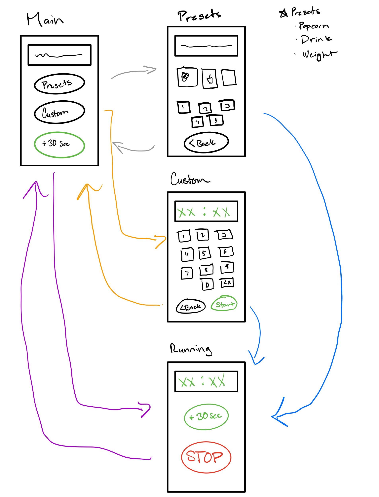

# Project 1: The Microwave Interface
Spring 2021 Human Computer Interaction Microwave Project

---

**Photo Of My Current Microwave Interface**

**My Microwave In Operation**

**Current Issues**
- Crowded with buttons therefore sometimes it hard to find the button I need
- Unintuitive to set a custom cook time. What if I need to heat something for exactly 2 minutes and 53 seconds? I am unable to do so.
- Frozen Dinner option is not universal. Typically, frozen dinners have specific instuctions on how long to heat for. This button is deceiving.
- If a session is not finished, the time remain to cook will stay on screen. This could be misinterperated as the time causing confusion.
- After choosing a preset, user must put in additional information and press start. Some users would opt to just use a preset time and stop when ready rather than put in a bunch of information. A microwave is to heat up food quickly. More button inputs mean more time to heat up food.

---
**My Common and Rare Uses of my Microwave** 
|Common Uses|Rare Uses|
|-|-|
|Reheat food quickly| 5+ minutes of heating|
|Pop popcorn|Heat drink|
|Cook microwave meals|Timer|
||Clock|
||Defrost frozen items|

**Does the current interface make the common things easier?** Yes

**Common Sequence of Actions**
1. User places food into microwave.
2. User chooses approximate preset minute time to cook food.
3. User waits for cook time to finish or stop the cooking before cook time is finished.
4. (Optional) If food needs to heat longer, the user continues to heat in 30 second intervals.

**How does the microwave support the user figure out how to make it work?**

The microwave display has small indicators to tell the user what is going on such as indicating the user has to input an amount, and flashing the time if the user has time remaining to cook.

**How does the microwave provide feedback to the user?**

When a button is pressed on the microwave, the microwave beeps once. When the microwave is finished cooking, the microwave plays 3 long beeps. The microwave also has a small display at the top showing cook time, time, and necessary input.

**What are some common mistakes you can make with this current design**
- Possible to mistake remaining cook time for clock time
- Triggering preset cook minutes when trying input custom cook time
- Unintentionally pressing wrong button due to clustered interface
- Mistaking add 30 seconds button with the stop/clear button due to similar design

**What improvement can be made?**
- Reduce the number of button inputs
- Distinguish +30 seconds button from stop button
- Simplify putting a custom cook time
- Remove unnecessary features

**Low-Fidelity Sketches**

---